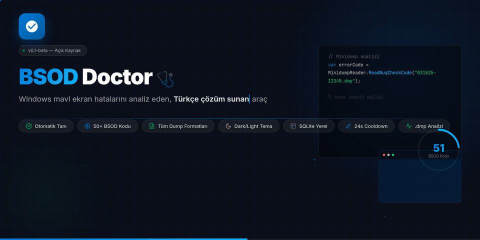

<p align="center">
  
</p>

# BSOD Doctor 🩺

Windows BSOD (mavi ekran) hatalarını analiz eden, tanımlayan ve Türkçe çözüm sunan araç. Minidump dosyalarını doğrudan okuyup hata kodunu çıkararak kullanıcıya adım adım rehberlik eder.

---

## ✨ Özellikler

- **Otomatik tanı** — Uygulama başlarken minidump dizinini tarar, yeni hataları yakalar
- **50 BSOD kodu** — En yaygın mavi ekran hataları için Türkçe açıklama, çözüm adımları ve kesin çözüm özeti
- **Tüm dump formatları** — PAGEDUMP64, PAGEDUMP32 ve klasik MDMP (ClrMd gerekmez)
- **Dark / Light tema** — Kullanıcı tercihi kalıcı olarak kaydedilir
- **Geçmiş listesi** — Çözülmemiş kayıtlar, tek tıkla detay görüntüleme
- **24s cooldown** — Aynı hata tekrar bildirilmez
- **SQLite** — Kurulum gerektirmez, her şey yerelde

---

## 🚀 Hızlı Başlangıç

```bash
git clone https://github.com/burakdmrbkr/bsod_doctor.git
cd bsod_doctor
dotnet run --project src/BsodDoctor
```

**Gereksinim:** Windows 10/11, [.NET 10 SDK](https://dotnet.microsoft.com/en-us/download/dotnet/10.0), yönetici yetkisi.

Kurulum sürümü için GitHub Releases sayfasından `.exe` indirip çalıştırın.

---

## 🧱 Proje Yapısı

```
bsod_doctor/
├── src/BsodDoctor/            # WPF uygulaması (MVVM)
│   ├── ViewModels/            # MainViewModel (CommunityToolkit.Mvvm)
│   ├── Models/                # BsodError, AnalysisResult, HistoryItem
│   ├── Services/              # MinidumpReader, BsodWatchService, DatabaseService
│   └── Resources/Themes/      # Dark / Light tema XAML'leri
├── tests/                     # Synthetic dump ile doğrulama
├── database/                  # seed_data.json (50 BSOD kodu + çözümler)
├── setup/                     # InnoSetup kurulum betiği
└── .github/workflows/         # CI/CD: build → test → publish → release
```

---

## 📄 Lisans

MIT